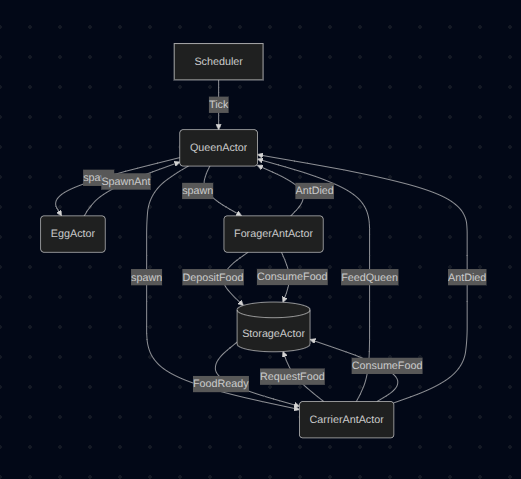

# Projet Programmation Fonctionnelle 2026 : Ant Colony

## Overview

Ce projet simule un **système critique distribué** en utilisant le modèle
d'acteurs (Akka + Scala 2). La survie de la colonie repose sur un invariant
critique : **la Reine doit rester en vie**. Si sa faim dépasse le seuil
maximum, la colonie s'effondre.

L'objectif académique est de modéliser ce système avec des acteurs Akka,
puis de le traduire formellement en réseau de Pétri pour vérifier
l'absence de deadlocks et le respect des invariants métier.

## Architecture des acteurs

| Acteur | Rôle |
|--------|------|
| `QueenActor` | Composant critique. Gère sa faim, pond des œufs, supervise les naissances et décès de fourmis |
| `EggActor` | Représente un œuf en incubation. Éclot après 2 cycles en fourrageuse ou transporteuse |
| `ForagerAntActor` | Cherche de la nourriture à l'extérieur et la dépose dans le stockage |
| `CarrierAntActor` | Prend la nourriture du stockage et la livre à la reine |
| `StorageActor` | Buffer partagé entre fourrageuses et transporteuses |
| `Simulation` | Lance les acteurs initiaux et le scheduler de la reine |

## Flux de messages critiques



## Invariants métier actuels

- La faim de la reine est toujours dans `[0, MaxHunger=10]`
- Il ne peut pas y avoir plus de 4 fourrageuses simultanément
- Il ne peut pas y avoir plus de 4 transporteuses simultanément
- Une fourmi morte notifie la reine pour mettre à jour les compteurs
- Le stock ne peut pas dépasser `MaxCapacity=20`
- Le stock ne peut pas être négatif


## Cycles réalisés

| Cycle | Contenu | Statut |
|-------|---------|--------|
| 1 | Reine seule : hunger, Tick, FeedQueen, mort | ✅ |
| 2 | Fourmi ouvrière unique : SearchFood, FoundFood | ✅ |
| 2.5 | Supervision, invariants métier, Terminated | ✅ |
| 3 | Fourrageuse + Stockage + Transporteuse | ✅ |
| 3.5 | Fatigue, repos, mort de faim des fourmis | ✅ |
| 4 | Ponte de la reine, incubation, éclosion, limite par catégorie | ✅ |
| 5 | Tests unitaires | 🔲 |
| 6 | Réseau de Pétri manuel + analyseur | 🔲 |
| 7 | Logique LTL + rapport de vérification | 🔲 |

## Installation & Exécution

### Prérequis
* SBT 1.X (Scala Build Tool)
* Java JDK 21
* Scala 2.13

### Lancer la simulation
Le projet utilise un workflow standard SBT. Pour compiler et lancer le système :

```bash
sbt run
```

Appuie sur **Entrée** pour arrêter proprement le système.

### Nettoyer les builds

```bash
sbt clean
```

À faire si les builds s'accumulent ou si tu changes de version de dépendances.

### Structure des fichiers source

```
app/src/main/
├── scala/
│   ├── Main.scala              # Point d'entrée de l'application
│   ├── actors/                 # Logique des acteurs (FSM)
│   │   ├── QueenActor.scala
│   │   ├── EggActor.scala
│   │   ├── ForagerAntActor.scala
│   │   ├── CarrierAntActor.scala
│   │   └── StorageActor.scala
│   ├── domain/                 # Logique métier et invariants
│   │   └── Invariants.scala
│   ├── protocol/               # Définition des messages (Case Classes/Objects)
│   │   └── Messages.scala
│   └── simulation/             # Setup du système d'acteurs
│       └── Simulation.scala
└── resources/
└── logback.xml             # Configuration de la journalisation SLF4J
```
